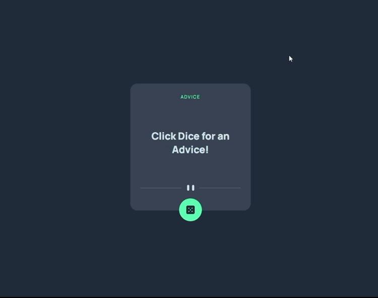

<h1>Advice Generator</h1>

Este proyecto pertenece a uno de los retos de <a href="https://www.frontendmentor.io/home">Frontend Mentor</a> que tiene como función principal mostrar al usuario un consejo cada vez que haga click en el boton

<h1>Preview del proyecto<h1>

<h1>Funciones principales</h1>
  <ul>
    <li>Dar la bienvenida al cliente e indicarle como funciona.</li>
    <li>Tener un hover effect sobre el botón para que el cliente sepa que es clickeable.</li>
    <li>Mostrar el número del consejo.</li>
    <li>Ajustar el tamaño del cuadro contenedor según el largo del texto.</li>
  </ul>
  
  <h1>Recursos utilizados</h1>
  <ul>
    <li><a href="https://api.adviceslip.com/">Advice API</a></li>
    
Esta API proporciona cientos de cnosejos al usuario, tiene las funciones de buscar de forma aleatoria, por Id o modo redes sociales, que mostrará un consejo aleatorio por dia, para más información se puede consultar en la documentaciñon del API.

    <li><a href="https://www.frontendmentor.io/home">Frontend Mentor</a></li>
    
Pagina Web que proporciona toda la información necesaria para realizar proyectos como estos.

  </ul>
  
  <h1>Código</h1>
  
Con toda libertad puedes bajar o clonar este repositorio!

  
Si tienes algún comentario o tienes una mejor forma de desarrollar el código no dudes en comentarlo! Sharing Is Caring!

